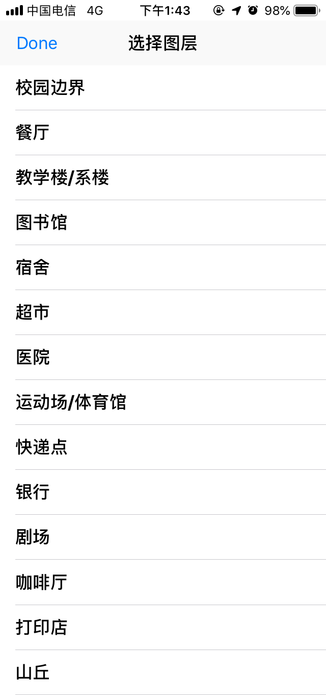
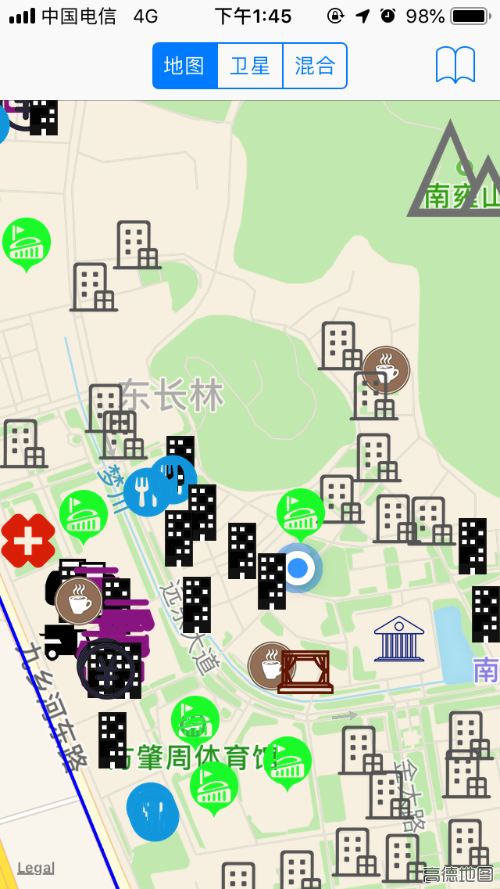

# CampusMap

iOS地图作业

## 扩展功能

- 显示小蓝点（当前位置）

- 增加并细化兴趣点图层，包括：
  - 餐厅（7个）
    
  - 教学楼/系楼（25个）
    
  - 图书馆（1个）
    
  - 宿舍（25个）
    
  - 超市（5个）
    
  - 医院（1个）
    
  - 运动场/体育馆（10个）
    
  - 快递点（1个）
    
  - 银行（3个）
    
  - 剧场（1个）
    
  - 咖啡厅（4个）
    
  - 打印店（2个）
    
  - 山丘（1个）
    

